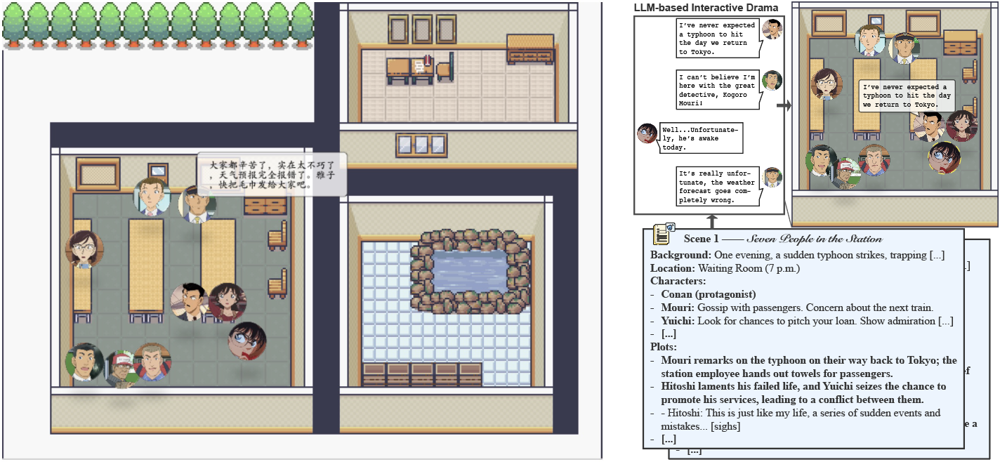
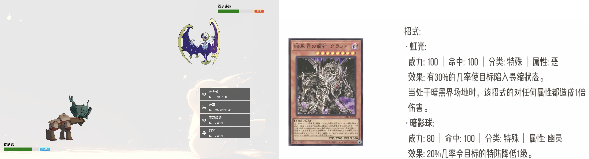

Hey guys, this is 伍鸿秋 (Hongqiu Wu). I am now a PhD student in Deptment of CS, Shanghai Jiao Tong University, supervised by Professor Hai Zhao and Min Zhang.
My research interest includes **open virtual world**, **interactive drama**, and **error correction**. I achieved the best on [AdvGLUE](https://adversarialglue.github.io) and [HellaSWAG](https://leaderboard.allenai.org/hellaswag/submissions/public). I'm serveing as reviewer/area chair for ARR, NeurIPS, etc.

I'm working as an intern at Anuttacon.

---
# Project

### Interactive Drama

Our second work explored the empowerment of the player that can have an impact on the characters in the drama, which is crucial for building a deep interactive experience. We call this **Agency**. [[demo]](https://www.xiaohongshu.com/explore/67c062c50000000029029ab8?xsec_token=AB72_SeYVn1jO24ady7bgdzLsL8nX4zS4ZwQj0D0F3cQw=&xsec_source=pc_user) [[ACL 2025]](https://arxiv.org/pdf/2502.17878)

We developed LLM-based interactive drama in a script of Detective Conan, where audience can step into the play to interact with the characters. [[repo]](https://github.com/gingasan/interactive-drama) [[zhihu]](https://zhuanlan.zhihu.com/p/698845230) [[ACL 2024]](https://arxiv.org/pdf/2405.14231)

This is our demonstration of LLM-based interactive Drama, script 《候车室的七个人》 (***Seven in the Waiting Room***).

### Free Pokémon

A new game genre **Open Role-Playing Game (ORPG)**. Players are allowed to craft their own pokemons by issuing natural language scripts. [[repo]](https://github.com/gingasan/delta-engine/tree/main/delta-pokemon) [[video]](https://www.bilibili.com/video/BV1FtYkehEHF)

### ReLM

We released ReLM (Rephrasing Language Model), a new state-of-the-art standard for Chinese Spelling Correction (CSC). [[repo]](https://github.com/gingasan/lemon) [[zhihu]](https://zhuanlan.zhihu.com/p/666826419); LEMON, a novel multi-domain CSC benchmark with ByteDance. [[repo]](https://github.com/gingasan/lemon)

---

# Education

* PhD, Department of Computer Science and Engineering, Shanghai Jiao Tong University, 2020 - present

* Bachelor of Engineering, Information Engineering, Shanghai Jiao Tong University, 2015 - 2020

---

# Publication

\* denotes equal contribution

**2025**

* [[ACL 2025]](https://arxiv.org/pdf/2502.17878) **Hongqiu Wu**, Weiqi Wu, Tianyang Xu, Jiameng Zhang, Hai Zhao. Towards Enhanced Immersion and Agency for LLM-based Interactive Drama.
* [[ACL 2025]](https://arxiv.org/pdf/2408.09386) Jiale Hong\*, **Hongqiu Wu**\*, Hai Zhao. Game Development as Human-LLM Interaction.
* [[ACL 2025]](https://arxiv.org/pdf/2408.09853) Weiqi Wu, **Hongqiu Wu**, Hai Zhao. X-TURING: Towards an Enhanced and Efficient Turing Test for Long-Term Dialogue Agents.
* [[COLING 2025]]() Linfeng Liu, **Hongqiu Wu**, Hai Zhao. Driving Chinese Spelling Correction from a Fine-Grained Perspective.

**2024**

* [[EMNLP 2024 Demo]](https://arxiv.org/pdf/2404.00276) **Hongqiu Wu**\*, Xingyuan Liu\*, Yan Wang, Hai Zhao. Instruction-Driven Game Engine: A Poker Case Study.
* [[Arxiv]](https://arxiv.org/pdf/2408.05842) **Hongqiu Wu**, Zekai Xu, Tianyang Xu, Jiale Hong, Weiqi Wu, Yan Wang, Hai Zhao, Min Zhang, Zhezhi He. Evolving Virtual World with Delta-Engine.
* [[ACL 2024]](https://arxiv.org/pdf/2405.14231) Weiqi Wu\*, **Hongqiu Wu**\*, Lai Jiang, Xingyuan Liu, Jiale Hong, Hai Zhao, Min Zhang. From Role-Play to Drama-Interaction: An LLM Solution.
* [[ACL 2024]](https://aclanthology.org/2024.findings-acl.413.pdf) Lai Jiang\*, **Hongqiu Wu**\*, Hai Zhao, Min Zhang. Chinese Spelling Corrector Is Just Language Learner.
* [[COLING 2024]](https://arxiv.org/pdf/2305.05253) Yifei Yang\*, **Hongqiu Wu**\*, Hai Zhao. Attack Named Entity Recognition by Entity Boundary Interference.
* [[COLING 2024]](https://arxiv.org/pdf/2402.16470) Khai Jiet Liong, **Hongqiu Wu**, Hai Zhao. Unveiling Vulnerability of Self-Attention.
* [[AAAI 2024]](https://arxiv.org/pdf/2308.08796) Linfeng Liu\*, **Hongqiu Wu**\*, Hai Zhao. Chinese Spelling Correction as Rephrasing Language Model.

**2023**

* [[EMNLP 2023]](https://aclanthology.org/2023.emnlp-main.847.pdf) **Hongqiu Wu**, Linfeng Liu, Hai Zhao, Min Zhang. Empower Nested Boolean Logic via Self-Supervised Curriculum Learning.
* [[ACL 2023]](https://aclanthology.org/2023.acl-long.600.pdf) **Hongqiu Wu**, Shaohua Zhang, Yuchen Zhang, Hai Zhao. Rethinking Masked Language Modeling for Chinese Spelling Correction. 
* [[ICLR 2023]](https://arxiv.org/pdf/2305.04557.pdf) **Hongqiu Wu**, Yongxiang Liu, Hanwen Shi, Hai Zhao, Min Zhang. Toward Adversarial Training on Contextualized Language Representation.
* [[AAAI 2023]](https://arxiv.org/pdf/2206.12608) **Hongqiu Wu**, Ruixue Ding, Hai Zhao, Pengjun Xie, Fei Huang, Min Zhang. Adversarial Self-Attention for Language Understanding.

**2022**

* [[EMNLP 2022]](https://aclanthology.org/2022.findings-emnlp.482.pdf) **Hongqiu Wu**, Ruixue Ding, Hai Zhao, Boli Chen, Pengjun Xie, Fei Huang, Min Zhang. Forging Multiple Training Objectives for Pre-trained Language Models via Meta-Learning.
* [[COLING 2022]](https://aclanthology.org/2022.coling-1.267.pdf) Yiyang Li, **Hongqiu Wu**, Hai Zhao. Semantic-Preserving Adversarial Code Comprehension.

**2021**

* [[Arxiv]](https://arxiv.org/pdf/2104.04692) **Hongqiu Wu**, Hai Zhao, Min Zhang. Not All Attention Is All You Need.
* [[ACL 2021]](https://aclanthology.org/2021.findings-acl.93.pdf) **Hongqiu Wu**, Hai Zhao, Min Zhang. Code Summarization with Structure-induced Transformer.

# Honor
* National Scholarship (国家奖学金)
* Huawei Scholarship (华为奖学金)
* Intel Scholarship (英特尔奖学金)
* Third place in Obei Cup
* Outstanding Student Scholarship
* The SJTU Cup Champions for Football

# Talk

* **LLM-based Interactive Drama**, Netease, Hangzhou, 2024.11
* **Open Virtual World and Delta-Engine**, SJTU-CS Global Lunch Seminar, Shanghai, 2024.10
* **LLM-based Interactive Drama**, Minimax, Shanghai, 2024.9

# Experience
* Research Intern, miHoYo LumiNLP
* Research Intern, ByteDance AI Lab
* Research Intern, Alibaba DAMO Academy
* Research Intern, Xiaomi AI Lab
* Algorithm Engineer Intern, Jing Dong Digits
* Algorithm Engineer Intern, Ping An Insurance
